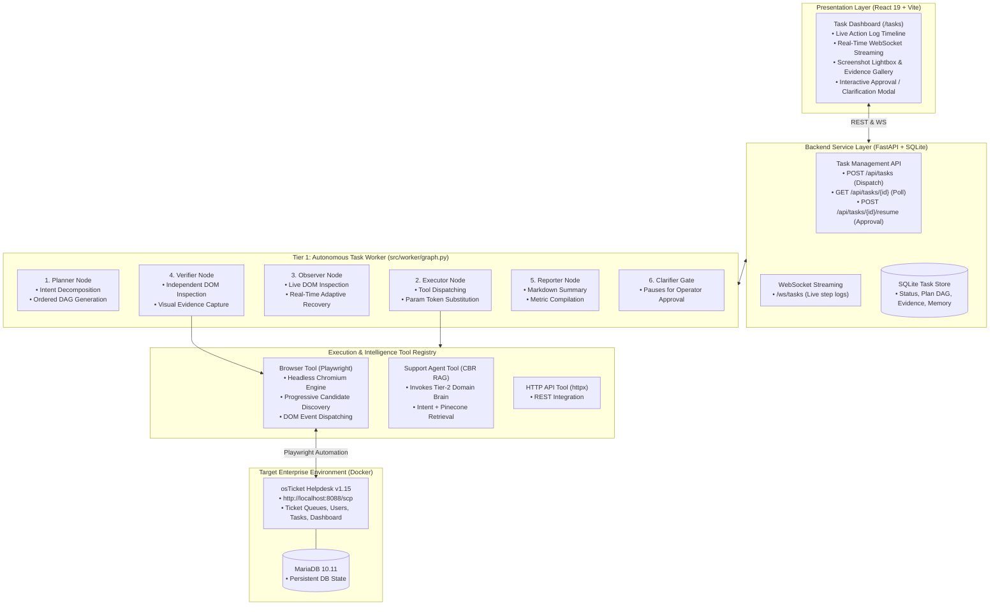
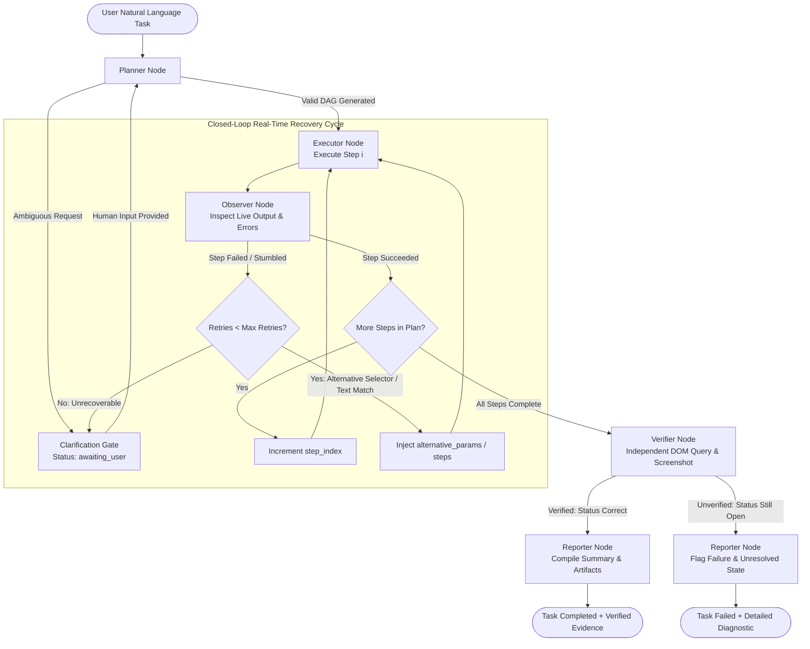

# CentrAlign AI Employee: Autonomous Enterprise Task Worker

An autonomous AI task worker prototype built for enterprise operations. It accepts high-level natural language instructions, autonomously plans multi-step execution sequences, drives real enterprise software (osTicket) via browser automation, dynamically observes and adapts to errors in real time, and independently verifies outcomes with visual screenshot evidence.

---

## 1. System Architecture

The solution implements a **Hierarchical Two-Tier StateGraph Architecture** that decouples general computer-use task execution from domain-specific intelligence.

### 1.1 End-to-End System & Runtime Topology



---

### 1.2 Core Execution & Adaptive Recovery Lifecycle

The Task Worker executes tasks through a **Closed-Loop Act-Observe-Decide Cycle**:



---

### 1.3 State Node Responsibilities

| State Node | Module Path | Core Responsibilities |
|---|---|---|
| **Planner** | [`src/worker/planner.py`](file:///c:/Users/Ahad/Documents/repos/customer_support_agent/src/worker/planner.py) | Analyzes natural language instructions, detects ambiguity, structures goal definition, and generates an ordered sequence of typed `PlanStep` actions. |
| **Executor** | [`src/worker/executor.py`](file:///c:/Users/Ahad/Documents/repos/customer_support_agent/src/worker/executor.py) | Resolves dynamic memory variables (`{last_output}`, `{support_response}`, `{ticket_reply_status}`), enforces security credentials, and dispatches actions to tool implementations. |
| **Observer** | [`src/worker/observer.py`](file:///c:/Users/Ahad/Documents/repos/customer_support_agent/src/worker/observer.py) | Closed-loop feedback controller: inspects tool execution output, detects errors/timeouts, and dynamically generates alternative selectors or steps in real time without aborting the task. |
| **Verifier** | [`src/worker/verifier.py`](file:///c:/Users/Ahad/Documents/repos/customer_support_agent/src/worker/verifier.py) | Independently formulates verification checks, inspects actual live DOM entity states (e.g., verifying `Status: Resolved` vs `Status: Open`), captures screenshot evidence, and rejects false-positive completions. |
| **Reporter** | [`src/worker/reporter.py`](file:///c:/Users/Ahad/Documents/repos/customer_support_agent/src/worker/reporter.py) | Compiles structured Markdown execution summaries, action counts, retry metrics, and attached screenshot galleries for human operators. |

---

## 2. Setup & Run Instructions

### Prerequisites
- **Python 3.11+** with [`uv`](https://github.com/astral-sh/uv)
- **Node.js 18+** & `npm`
- **Docker Desktop** (for running osTicket & MariaDB)

---

### Step 1: Environment Configuration
Create a `.env` file in the root directory (or copy `.env.example`):

```env
# LLM Provider Keys (Groq / Gemini / OpenAI via LiteLLM)
GROQ_API_KEY="gsk_..."
GROQ_MODEL="groq/openai/gpt-oss-120b"
GEMINI_API_KEY="AQ..."
GEMINI_MODEL="gemini-3.8-flash"
LLM_MODEL="groq/openai/gpt-oss-120b"
FALLBACK_MODELS="groq/openai/gpt-oss-20b,groq/qwen/qwen3.8-27b"

# osTicket Helpdesk Integration
OSTICKET_URL="http://localhost:8088"
OSTICKET_STAFF_USER="ostadmin"
OSTICKET_STAFF_PASS="Admin1"

# Vector Search (Optional for Domain Brain)
PINECONE_API_KEY="pcsk_..."
PINECONE_INDEX_NAME="spotify-support-cases"
```

---

### Step 2: Start Services

#### 1. Start osTicket Helpdesk (Docker)
```bash
docker compose -f osticket/docker-compose.yml up -d
```
*osTicket is accessible at `http://localhost:8088` (Staff Control Panel at `http://localhost:8088/scp`).*

#### 2. Start Backend API (FastAPI + WebSockets)
```bash
uv sync
uv run uvicorn backend.main:app --reload --port 8000
```

#### 3. Start Frontend Web App (React 19 + Vite)
```bash
cd frontend-web
npm install
npm run dev
```

---

### Step 3: Access Interfaces
- **Autonomous Task Dashboard:** [`http://localhost:5173/tasks`](http://localhost:5173/tasks) — Interactive task runner with live step execution traces, screenshot lightbox, and manual approval gates.
- **Customer Chat & HITL Console:** [`http://localhost:5173`](http://localhost:5173) and [`http://localhost:5173/agent`](http://localhost:5173/agent).
- **FastAPI OpenAPI Documentation:** [`http://localhost:8000/docs`](http://localhost:8000/docs).

---

### Step 4: Run Automated Tests
```bash
# Run all 169 unit & integration tests
uv run pytest
```

---

## 3. In-Depth Technical Documentation

For complete technical specifications, design decisions, known limitations, assumptions, future roadmap, and component breakdowns, refer to:
👉 **[AUTONOMOUS_WORKER_TECHNICAL_DOCS.md](AUTONOMOUS_WORKER_TECHNICAL_DOCS.md)**
