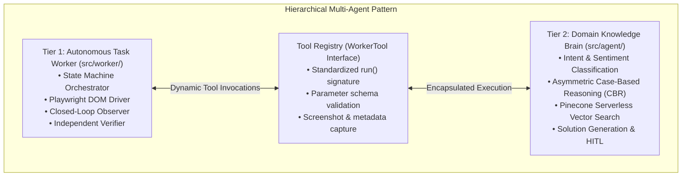
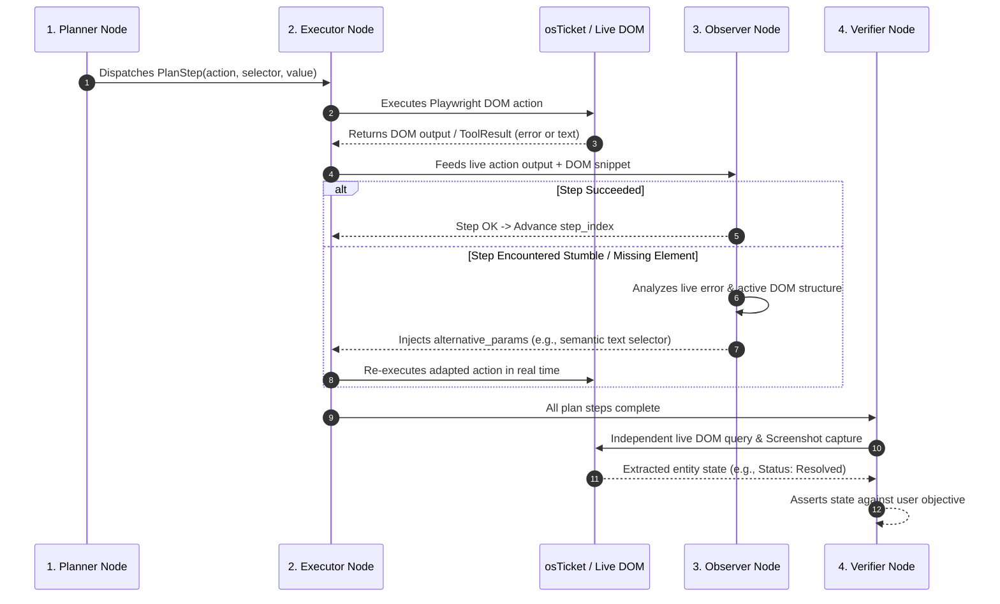
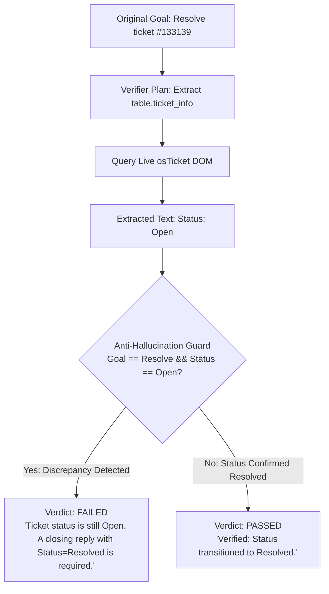

# Technical Architecture & System Design: Autonomous Enterprise Task Worker

This document provides a comprehensive, in-depth technical analysis of the engineering principles, architectural patterns, design decisions, safety mechanisms, known limitations, and future roadmap of the **CentrAlign Autonomous AI Task Worker** prototype.

---

## 1. Architectural Patterns & Decision Matrix



---

### 1.1 Closed-Loop Act-Observe-Decide vs. Linear One-Shot Scripting

#### The Engineering Problem:
Traditional LLM agents generate a static list of actions (e.g. `[Step 1: click A, Step 2: type B, Step 3: click C]`) and execute them sequentially. In real enterprise web software, one-shot execution fails frequently due to:
- Shifting DOM trees and dynamic IDs.
- Asynchronous modal and tab render delays.
- Form validation errors and unexpected redirect routes.

#### The Architectural Solution:
The worker implements a **Cyclical State Machine** via LangGraph where execution is mediated by an **Observer node** (`src/worker/observer.py`).



---

### 1.2 Independent Verification Node with Anti-Hallucination Guardrails

#### The Engineering Problem:
In web applications like osTicket, submitting a form displays a success toast (e.g. *"Ticket #370389: Reply posted successfully"*), but the underlying entity state might still remain in `Status: Open` because the status dropdown was not explicitly modified. Naive agents falsely assume the task is finished based purely on superficial banners.

#### The Architectural Solution:
The **Verifier node** (`src/worker/verifier.py`) operates as an independent post-execution auditor:
1. **Dynamic Verification Planning:** The verifier inspects the original task goal and generates targeted inspection steps (e.g. extracting `table.ticket_info`).
2. **Deterministic Anti-Hallucination Guard:** For resolution tasks, even if an LLM evaluator outputs `passed: True`, deterministic code guards verify that:
   - The ticket status actually transitioned out of `Open` into `Resolved` / `Closed`.
   - If the extracted DOM text still contains `Status: Open` or no action set `reply_status_id = "Resolved"`, the verifier overrides the verdict to **Failed** with actionable diagnostic details.



---

### 1.3 Progressive Multi-Strategy DOM Locator Pipeline

#### The Engineering Problem:
Hardcoded XPaths or static IDs break across responsive layouts, browser rendering engines, and theme variants.

#### The Architectural Solution:
The `BrowserTool` (`src/worker/tools/browser.py`) resolves target elements through a 4-tier progressive discovery pipeline:

```mermaid
flowchart LR
    INPUT([Target Selector / Action Request]) --> S1{Tier 1: Exact Selector\nlocator(selector)}
    S1 -->|Found & Visible| EXECUTE[Execute DOM Interaction]
    S1 -->|Not Found| S2{Tier 2: Hierarchy & Visibility\ninput:visible, div[contenteditable]:visible}
    S2 -->|Found| EXECUTE
    S2 -->|Not Found| S3{Tier 3: Semantic Text Match\na:has-text('Dev Soni'), input[value='Post Note']}
    S3 -->|Found| EXECUTE
    S3 -->|Not Found| S4{Tier 4: Observer Adaptation\nInject alternative params}
    
    EXECUTE --> DISPATCH[Dispatch Native Events\n'change', 'input', 'Enter']
```

1. **Exact Selector Resolution:** Queries the target locator specified in the plan step.
2. **Visibility Fallback Search:** Queries visible input/textarea/contenteditable candidates in active dialogs or tabs.
3. **Semantic Text Matching:** Matches visible button/link text directly (e.g., `a:has-text('Unassigned')`, `input[value='Post Note']`).
4. **Native Event Dispatching:** Dispatches standard browser `change` and `input` events to ensure framework event listeners (e.g., jQuery, React state bindings) register values.

---

### 1.4 Hierarchical "Sub-Graph as a Tool" Encapsulation

#### The Engineering Problem:
Coupling customer support domain intelligence (vector embeddings, similarity thresholds, brand tone rules) into the general computer-use agent ruins reusability and architectural generalization.

#### The Architectural Solution:
The Autonomous Task Worker is **100% domain-agnostic**. Domain intelligence is encapsulated inside the `support_agent` tool:
- The worker executes browser operations, extracts text threads, and calls `support_agent(query=...)`.
- The `SupportAgentTool` internally invokes the Tier-2 LangGraph (`src/agent/graph.py`), executing intent classification, Pinecone vector search, and solution generation.
- Swapping the ticketing tool from osTicket to Jira, or swapping the knowledge base from Spotify to internal IT policies, requires **zero structural changes** to the Task Worker state machine.

---

### 1.5 Deterministic Security & PII Redaction

#### The Engineering Problem:
Autonomous browser agents operate on sensitive enterprise data (passwords, credit card numbers, billing information). Storing these in cleartext logs or exposing them to external LLM prompts creates severe compliance violations.

#### The Architectural Solution:
1. **Credential Isolation:** The Executor (`src/worker/executor.py`) deterministically injects environment credentials into login fields (`input[name='userid']` / `input[name='passwd']`) without requiring the LLM to handle plaintext secrets.
2. **PII Masking Pipeline:** `src/worker/security.py` applies recursive regex sanitization over action parameters and output payloads, redacting 16-digit credit card patterns and CVVs with `[REDACTED]`.

---

## 2. Known Limitations

1. **DOM Tree Dependency (No Visual Coordinate / Canvas Grounding):**
   - The worker currently interacts via Playwright DOM locators. It cannot natively manipulate non-DOM canvas environments (e.g. legacy Windows desktop software via Citrix/VNC) without an image coordinate visual grounding model.
2. **Sequential Single-Threaded Task Execution:**
   - Tasks are executed sequentially step-by-step. The architecture does not currently run multi-threaded concurrent browser sessions (e.g., processing 50 tickets simultaneously across parallel browser contexts).
3. **Session State Lifetime:**
   - Browser sessions are ephemeral per task execution. The worker authenticates at the start of each task rather than maintaining a shared, persistent authenticated session pool.
4. **Interactive CAPTCHAs & Complex Drag-and-Drop:**
   - Designed for authenticated internal enterprise software. Does not bypass third-party bot-detection CAPTCHAs or non-standard canvas drag-and-drop builders without triggering a human clarification gate.

---

## 3. What We Would Build Next (Future Roadmap)

Given additional engineering time, we would implement the following enterprise capabilities:

### 3.1 Multimodal Vision Grounding (UI-VLM / Set-of-Marks)
- Integrate visual coordinate prediction models (e.g., UI-tailored Vision Language Models) to allow the worker to click and type on arbitrary desktop screens, PDF forms, and canvas-rendered dashboards without relying on HTML DOM trees.

### 3.2 Semantic Macro & Workflow Distillation
- Implement an execution trace compiler that analyzes repetitive successful task DAGs (e.g., standard daily triage patterns) and compiles them into deterministic, cached code macros. This reduces LLM inference costs and cuts execution latency from seconds to milliseconds.

### 3.3 Multi-Application Cross-System Workflows
- Extend the worker to orchestrate tasks across multiple disjoint enterprise tools in a single unified run:
  $$\text{osTicket (Billing Dispute)} \longrightarrow \text{Stripe API (Verify Charge)} \longrightarrow \text{Salesforce (Update Account)} \longrightarrow \text{Slack (Notify Team)}$$

### 3.4 Fine-Grained RBAC & Dual-Key Approval Gates
- Implement an enterprise security policy engine that classifies actions by risk tier (Read-Only vs. Mutation vs. Destructive/Financial). High-risk operations automatically trigger dual-key human approval before the executor commits the change.

---

## 4. Assumptions Made

1. **Target Environment Accessibility:** The enterprise software (osTicket) is accessible over local or internal network HTTP (`http://localhost:8088`) with staff credentials provisioned in `.env`.
2. **HTML5 Web Standards:** Target applications utilize standard HTML5 elements (`input`, `select`, `button`, `table`, `a`, `div[contenteditable]`), enabling standard Playwright locator interaction.
3. **Ticketing Resolution Protocol:** In osTicket, marking a ticket as `Resolved` is executed as part of the staff reply form by selecting `reply_status_id = "Resolved"` (ID `2`) alongside a closing response.
4. **Human Operator Availability:** When the agent encounters critical missing data or an ambiguous instruction, it assumes a human operator can respond via the `awaiting_user` clarification UI gate.

---

## 5. Details of Models, Frameworks, APIs & Pre-built Components

| Layer / Subsystem | Technology / Component | Role & Usage Details |
|---|---|---|
| **Primary LLM** | **Groq** (`openai/gpt-oss-120b`) | Ultra-fast structured JSON planning, real-time observation analysis, and verification evaluation (500+ tokens/sec). |
| **Fallback LLM** | **Google Gemini** (`gemini-3.8-flash`) / **OpenAI** (`gpt-4o-mini`) | Automatic rate-limit and service degradation fallback via LiteLLM routing. |
| **Inference Router** | **LiteLLM** | Unified LLM completion layer with structured JSON schema validation and retry logic. |
| **State Machine Engine** | **LangGraph** (`StateGraph`) | Cyclical graph execution engine managing task worker state transitions, retries, and human-in-the-loop pauses. |
| **Browser Automation** | **Playwright** (Python Async) | Headless Chromium execution, DOM element inspection, event dispatching, and evidence screenshot capture. |
| **Enterprise Application** | **osTicket v1.15** + **MariaDB** | Dockerized helpdesk providing realistic enterprise state (authentication, sessions, CSRF, relational DB, ticket queues). |
| **Vector Database** | **Pinecone Serverless** (`multilingual-e5-large`) | Case-Based Reasoning (CBR) vector store retrieving verified historical troubleshooting solutions. |
| **Backend Framework** | **FastAPI** + **Uvicorn** + **SQLite** | Asynchronous REST endpoints, task polling, and persistent execution state. |
| **Realtime Pub/Sub** | **WebSockets** | Real-time live execution trace streaming to frontend clients. |
| **Frontend Stack** | **React 19**, **Vite**, **TypeScript**, **Tailwind CSS v4** | Interactive Task Dashboard, step-by-step execution timeline, screenshot lightbox, and HITL console. |
| **Test Suite** | **Pytest** + **AnyIO** | 169 automated unit, integration, and security tests. |
