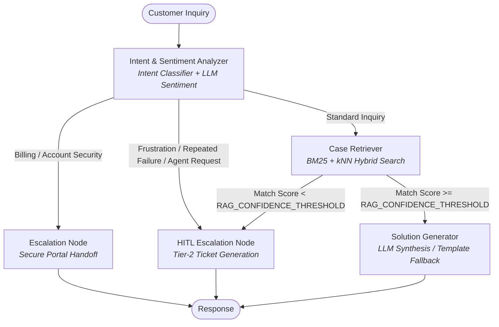

# SpotifyCares AI Support Agent

Case-Based Reasoning (CBR) customer support system using LangGraph, Elasticsearch Serverless hybrid search, and multi-provider LLM inference (Groq, Gemini, OpenAI).

---

## Architecture



### Core Components

1. **Retrieval Engine (CBR)**
   - **Store**: Elasticsearch Cloud Serverless (`spotify_support_cases` index).
   - **Vector Model**: In-cluster inference with `.jina-embeddings-v5-text-nano` (768 dimensions).
   - **Strategy**: Asymmetric problem-to-problem matching against historical `problem_vector` embeddings combined with BM25 keyword matching (`customer_message^2`, `resolution`, `conversation`).

2. **Sentiment & Escalation Engine**
   - **LLM Sentiment Analysis**: Context-aware evaluation of frustration, sarcasm, unhelpful automated advice, and explicit human requests via `litellm`.
   - **Caching Layer**: In-memory LRU cache keyed on query and dialogue history hash (`< 0.1ms` latency on duplicate requests).
   - **Dual Gate Escalation**:
     - *Pre-retrieval*: Triggers on high frustration ($\ge 0.5$), repeated failures, billing disputes, or human representative requests.
     - *Post-retrieval*: Triggers if top RAG match score is below `RAG_CONFIDENCE_THRESHOLD` (`20.0`).
   - **Handoff Ticket Generation**: Generates structured tickets (`SPOTIFY-T2-#####`) containing device metadata, conversation history, prior attempts, and priority.

3. **Model Provider Routing**
   - **Default**: Groq (`groq/openai/gpt-oss-120b`).
   - **Options**: Google Gemini (`gemini/gemini-3.8-flash`), OpenAI (`gpt-4o-mini`).
   - **Fallback**: Deterministic template synthesizer using verified CBR resolutions when API keys are absent.

4. **Evaluation Suite**
   - Automated LLM-as-a-judge system scoring responses on Relevance, Groundedness, Brand Voice, Actionability, and Escalation correctness.

---

## Project Structure

```
customer_support_agent/
├── data/
│   └── processed/
│       └── spotify_troubleshooting_cases.jsonl
├── src/
│   ├── agent/
│   │   ├── graph.py        # LangGraph StateGraph & conditional routing
│   │   ├── nodes.py        # Execution nodes (analyzer, retriever, generator, escalation)
│   │   ├── prompts.py      # System prompts & brand tone guidelines
│   │   ├── sentiment.py    # LLM sentiment engine with query caching
│   │   └── state.py        # SupportAgentState schema
│   ├── data/
│   │   ├── cleaner.py                 # PII scrubbing & text normalization
│   │   ├── extract_spotify_threads.py # Multi-turn conversation reconstruction
│   │   ├── intent_classifier.py       # Intent taxonomy and pattern matching
│   │   └── validate_dataset.py        # Dataset validation and quality metrics
│   ├── eval/
│   │   └── llm_judge.py    # Evaluation judge and golden test cases
│   └── rag/
│       ├── embeddings.py   # Elasticsearch inference client
│       ├── indexer.py      # Index lifecycle and bulk indexing
│       └── retriever.py    # Hybrid search implementation
├── tests/                  # Pytest test suites
├── main.py                 # Entrypoint CLI
└── pyproject.toml
```

---

## Environment Setup

Create `.env` in the repository root:

```env
# Elasticsearch Cloud
ELASTICSEARCH_ENDPOINT="https://<cluster-id>.es.<region>.aws.elastic.cloud:443"
ELASTICSEARCH_API_KEY="<api-key>"

# Primary LLM Provider (Default: Groq)
GROQ_API_KEY="<groq-api-key>"
GROQ_MODEL="openai/gpt-oss-120b"

# Optional Providers
GEMINI_API_KEY="<gemini-api-key>"
GEMINI_MODEL="gemini-3.8-flash"

OPENAI_API_KEY="<openai-api-key>"
OPENAI_MODEL="gpt-4o-mini"

# RAG Threshold
RAG_CONFIDENCE_THRESHOLD=20.0
```

---

## Dataset & Elasticsearch Setup

To build the knowledge base from scratch:

1. **Download Raw Dataset**:
   Download the dataset from [Kaggle: Customer Support on Twitter](https://www.kaggle.com/datasets/thoughtvector/customer-support-on-twitter). Unzip the archive and place `twcs.csv` in the `dataset/` directory (keep as `.csv`, do not re-save as `.xlsx`):
   ```text
   dataset/twcs.csv
   ```

2. **Extract & Clean Spotify Troubleshooting Cases**:
   Reconstruct multi-turn dialogue trees, scrub PII, and filter actionable troubleshooting resolutions:
   ```bash
   uv run python src/data/extract_spotify_threads.py --input dataset/twcs.csv --output_dir data/processed
   ```
   This outputs `data/processed/spotify_troubleshooting_cases.jsonl` (high-quality public troubleshooting cases).

3. **Index Knowledge Base into Elasticsearch**:
   Ensure `ELASTICSEARCH_ENDPOINT` and `ELASTICSEARCH_API_KEY` are configured in `.env`, then create vector index mappings and bulk-index:
   ```bash
   uv run python main.py --index --recreate
   ```

---

## Web UI

The project includes a chat UI with Human-in-the-Loop (HITL) handoff for support agents.

### Architecture

- **Backend**: FastAPI + SQLite + WebSockets (`backend/`)
- **Frontend**: React + Vite + Tailwind (`frontend/`)
- **Agent layer**: Unchanged — UI calls `run_support_agent()` from `src/agent/graph.py`

### Screens

| Route | Purpose |
|-------|---------|
| `/` | Customer chat — AI responses until HITL is triggered |
| `/agent` | Agent console — pending handoff queue, live takeover |

When HITL triggers (frustration, human request, low RAG confidence), the customer sees a waiting state and agents receive a real-time notification. An agent claims the ticket and takes over the conversation.

### Run the UI

**Terminal 1 — API server:**
```bash
uv sync
uv run uvicorn backend.main:app --reload --host 127.0.0.1 --port 8000
```

**Terminal 2 — Frontend dev server:**
```bash
cd frontend
npm install
npm run dev
```

Open [http://localhost:5173](http://localhost:5173) for customer chat and [http://localhost:5173/agent](http://localhost:5173/agent) for the agent console.

To test HITL, open both tabs. From the customer chat, try: *"I demand to speak to a real human representative right now."*

---

## Usage

### Interactive CLI
```bash
uv run python main.py
```

### Single Query
```bash
uv run python main.py -q "Spotify keeps skipping tracks on my Anker bluetooth speaker"
```

### Benchmark Evaluation
```bash
uv run python main.py --eval
```

### LLM Judge Report
```bash
uv run python src/eval/llm_judge.py
```

### Re-index Elasticsearch Knowledge Base
```bash
uv run python main.py --index --recreate
```

---

## Testing

Run test suite:
```bash
uv run pytest
```

Targeted test execution:
```bash
uv run pytest tests/test_hitl_escalation.py -v
uv run pytest tests/test_agent_graph.py -v
uv run pytest tests/test_retriever.py -v
```

---

## Retrieval Scoring Specification

Elasticsearch returns a compound relevance score:

$$\text{Score} = \text{BM25}(q, d) + (\text{Cosine}(v_q, v_d) \times \text{boost})$$

- **BM25**: Term frequency and inverse document frequency across query terms, weighted by field multipliers.
- **Dense Vector**: Cosine similarity normalized to $[0, 1]$, boosted by $0.8$.
- **Score Scale**:
  - `< 20.0`: Low relevance match; intercepted by confidence gate and routed to HITL.
  - `25.0 – 32.0`: Moderate semantic match.
  - `35.0 – 45.0+`: High-confidence match (matching device, symptoms, and resolution).
