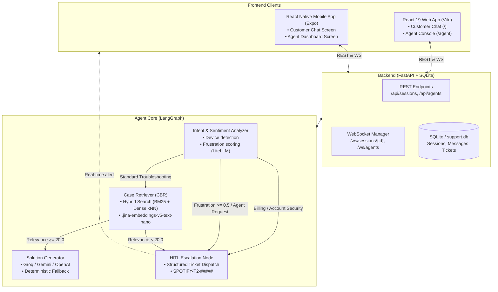

# SpotifyCares AI Support Platform

A Case-Based Reasoning (CBR) customer support platform with real-time Human-in-the-Loop (HITL) handoff. Powered by **LangGraph**, **Elasticsearch Serverless** hybrid search, **FastAPI + WebSockets**, **React 19**, and **React Native / Expo**.

---

## System Architecture



---

## Tech Stack

| Layer | Technologies |
|---|---|
| **Web Frontend** | React 19, TypeScript, Vite, Tailwind CSS v4, Marked, DOMPurify |
| **Mobile Frontend** | React Native, Expo SDK 57, React Navigation, Expo Constants, AsyncStorage |
| **Backend** | FastAPI, Uvicorn, SQLAlchemy, SQLite, WebSockets, Pydantic v2 |
| **Agent & Inference** | LangGraph, LiteLLM (Groq `gpt-oss-120b`, Gemini `gemini-3.8-flash`, OpenAI `gpt-4o-mini`) |
| **Search & Retrieval** | Elasticsearch Cloud Serverless, BM25 + Dense kNN (768d `.jina-embeddings-v5-text-nano`) |
| **Data & Tooling** | `uv`, Polars, PyArrow, Rich, Pytest |

---

## Project Structure

```
customer_support_agent/
├── backend/                  # FastAPI service & persistence layer
│   ├── database.py           # SQLite engine & session factory
│   ├── models.py             # SQLAlchemy models (ChatSession, ChatMessage, HitlTicket)
│   ├── schemas.py            # Pydantic request/response schemas
│   ├── routers/
│   │   ├── sessions.py       # Customer chat session endpoints
│   │   ├── agents.py         # Agent console ticket & message endpoints
│   │   └── ws.py             # WebSocket routes (/ws/sessions, /ws/agents)
│   ├── services/
│   │   ├── chat_service.py   # Agent execution wrapper & session state sync
│   │   └── websocket_manager.py # Real-time pub/sub connection manager
│   └── main.py               # FastAPI entrypoint, dynamic CORS & static mount
├── frontend-web/             # React 19 SPA (Spotify dark theme)
│   ├── src/
│   │   ├── pages/
│   │   │   ├── CustomerChat.tsx   # Customer conversational interface
│   │   │   └── AgentDashboard.tsx # HITL agent queue & live chat takeover
│   │   ├── components/       # MessageBubble, TicketCard, ChatInput, MarkdownContent
│   │   ├── hooks/            # useWebSocket hook
│   │   └── api/client.ts     # Typed fetch client
│   ├── vite.config.ts        # Vite dev server with /api and /ws proxy
│   └── package.json
├── frontend-mobile/          # React Native / Expo app (Spotify dark theme)
│   ├── src/
│   │   ├── screens/
│   │   │   ├── CustomerChatScreen.tsx   # Mobile chat with live server switcher
│   │   │   └── AgentDashboardScreen.tsx # Mobile HITL agent queue & takeover
│   │   ├── components/       # MessageBubble, ChatInput, TicketCard
│   │   ├── hooks/            # useWebSocket auto-reconnecting hook
│   │   └── api/client.ts     # Dynamic host discovery client (Expo Constants)
│   ├── App.tsx               # Native Stack Navigation entrypoint
│   ├── .env                  # Optional EXPO_PUBLIC_API_BASE_URL override
│   └── package.json
├── src/                      # Core agent & RAG pipeline
│   ├── agent/
│   │   ├── graph.py          # LangGraph StateGraph & conditional edge routing
│   │   ├── nodes.py          # Analyzer, retriever, generator, escalation nodes
│   │   ├── prompts.py        # System instructions & brand tone constraints
│   │   ├── sentiment.py      # LLM sentiment engine with LRU query caching
│   │   └── state.py          # SupportAgentState schema
│   ├── rag/
│   │   ├── indexer.py        # Elasticsearch mapping & bulk index lifecycle
│   │   ├── retriever.py      # BM25 + kNN hybrid retriever with compound scoring
│   │   └── embeddings.py     # In-cluster Elasticsearch dense inference client
│   ├── data/                 # Dataset preprocessing & PII extraction pipeline
│   └── eval/                 # LLM-as-a-judge evaluation suite
├── data/                     # Local SQLite database & processed datasets
├── tests/                    # Unit and integration test suites
├── main.py                   # CLI entrypoint (interactive, query, eval, indexing)
└── pyproject.toml
```

---

## Quickstart

### 1. Environment Configuration

Create `.env` in the root directory:

```env
# Elasticsearch Cloud Serverless
ELASTICSEARCH_ENDPOINT="https://<cluster-id>.es.<region>.aws.elastic.cloud:443"
ELASTICSEARCH_API_KEY="<api-key>"

# Primary LLM Provider (Default: Groq)
GROQ_API_KEY="gsk_..."
GROQ_MODEL="openai/gpt-oss-120b"

# Optional LLM Providers
GEMINI_API_KEY="AIzaSy..."
GEMINI_MODEL="gemini-3.8-flash"
OPENAI_API_KEY="sk-..."
OPENAI_MODEL="gpt-4o-mini"

# Retrieval Threshold
RAG_CONFIDENCE_THRESHOLD=20.0
```

---

### 2. Run Backend & Frontend Applications

#### Terminal 1 — Backend (FastAPI + WebSockets)
```bash
uv sync
uv run uvicorn backend.main:app --reload --host 0.0.0.0 --port 8000
```
*Note: Binding to `0.0.0.0` allows physical mobile devices on your Wi-Fi or mobile hotspot to connect.*

#### Terminal 2 — Web Frontend (React 19 + Vite)
```bash
cd frontend-web
npm install
npm run dev
```
* **Customer Chat**: [http://localhost:5173](http://localhost:5173)
* **Agent Console**: [http://localhost:5173/agent](http://localhost:5173/agent)
* **API Documentation**: [http://localhost:8000/docs](http://localhost:8000/docs)

#### Terminal 3 — Mobile Frontend (React Native / Expo)
```bash
cd frontend-mobile
npm install
npx expo start
```
Scan the QR code with **Expo Go** on iOS or Android, or press:
* `a` — Android emulator
* `i` — iOS simulator
* `w` — Web browser preview

**Mobile Connection & Auto-Discovery**:
* The mobile app uses **dynamic host resolution** via `expo-constants`. When opening via Expo Go, it automatically extracts your development machine's IP without requiring any manual IP configuration.
* Tap **⚙️ Server** in the top-right header of the mobile app to switch between:
  * **Auto-detected Host** (Wi-Fi / Hotspot IP)
  * **Android Emulator** (`http://10.0.2.2:8000`)
  * **Localhost** (`http://localhost:8000`)
  * Custom API URL
* **Mobile Hotspot / Windows Note**: If your laptop is connected to your phone's mobile hotspot, ensure your Wi-Fi network profile in Windows Settings is set to **Private** so Windows Defender Firewall permits incoming connections on port 8000.

---

### 3. Run CLI Interface

```bash
# Interactive multi-turn CLI session
uv run python main.py

# Single-query execution
uv run python main.py -q "Spotify keeps skipping tracks on my Anker bluetooth speaker"
```

---

## Human-in-the-Loop (HITL) Workflow

The system uses a **dual-checkpoint gate** to decide when human intervention is required:

1. **Pre-Retrieval Gate**:
   - Intent: Account security, billing disputes, or credentials.
   - Sentiment: Frustration score $\ge 0.5$, sarcastic tone, or explicit requests for a representative.
2. **Post-Retrieval Gate**:
   - RAG Confidence: Compound score $< 20.0$ against historical cases.

```
Customer triggers HITL
  └─► Agent generates Ticket (e.g. SPOTIFY-T2-78412)
  └─► Saved to SQLite (status: hitl_pending)
  └─► WebSocket event (hitl_new) broadcast to /ws/agents
  └─► Agent Console (Web & Mobile) displays ticket with diagnostics
  └─► Agent clicks "Claim Ticket" (status: human_active)
  └─► Live two-way WebSocket chat takeover between customer and human agent
  └─► Agent marks "Resolve" (status: closed)
```

---

## Knowledge Base & Elasticsearch Setup

To rebuild the vector index from raw Twitter customer support data:

1. **Place raw dataset**: Download [Customer Support on Twitter](https://www.kaggle.com/datasets/thoughtvector/customer-support-on-twitter) and place `twcs.csv` in `dataset/twcs.csv`.
2. **Extract & Clean Threads**:
   ```bash
   uv run python src/data/extract_spotify_threads.py --input dataset/twcs.csv --output_dir data/processed
   ```
3. **Index into Elasticsearch**:
   ```bash
   uv run python main.py --index --recreate
   ```

### Hybrid Retrieval Scoring

$$\text{Score} = \text{BM25}(q, d) + (\text{Cosine}(v_q, v_d) \times 0.8)$$

- **Score $< 20.0$**: Low relevance match $\rightarrow$ intercepted and escalated to HITL.
- **Score $25.0 - 32.0$**: Moderate semantic match $\rightarrow$ synthesized into step-by-step guidance.
- **Score $\ge 35.0$**: High-confidence match $\rightarrow$ verified device-specific resolution.

---

## Testing & Evaluation

```bash
# Run full test suite
uv run pytest

# Run targeted subsystem tests
uv run pytest tests/test_hitl_escalation.py -v
uv run pytest tests/test_agent_graph.py -v
uv run pytest tests/test_retriever.py -v

# Run LLM-as-a-Judge benchmark evaluation
uv run python main.py --eval
# or
uv run python src/eval/llm_judge.py
```
